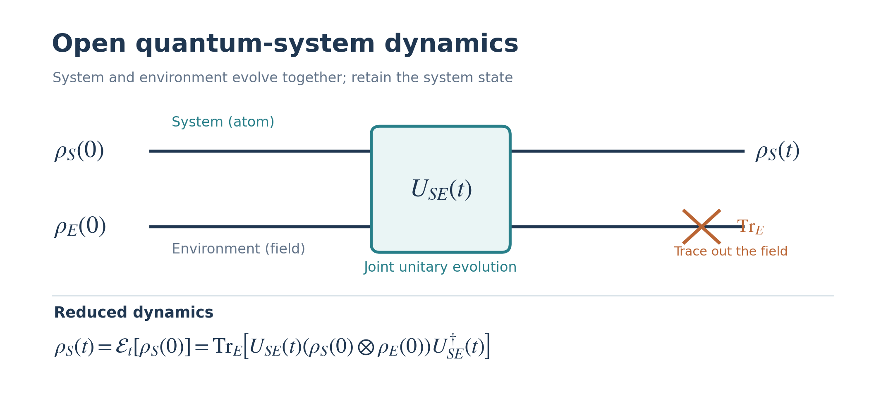

# Quantum Master Equation

A Python learning project for open quantum systems, quantum channels, and the Lindblad master equation. The notebooks connect mathematical derivations with numerical examples.

## Physics overview

An isolated quantum system evolves unitarily. An **open quantum system** interacts with an environment, so its reduced state can exhibit decay and decoherence.

*The atom and environment evolve together. Tracing out the environment gives the state of the atom alone.*

## Notes on the approximations

The combined system and environment evolve unitarily. Deriving a closed master equation for the system commonly involves weak system–environment coupling, a short environment memory time, and a secular approximation. Whether these assumptions are appropriate depends on the physical model.

## Purpose

This repository is a study resource for working through the mathematics of open quantum systems and checking the results with Python.